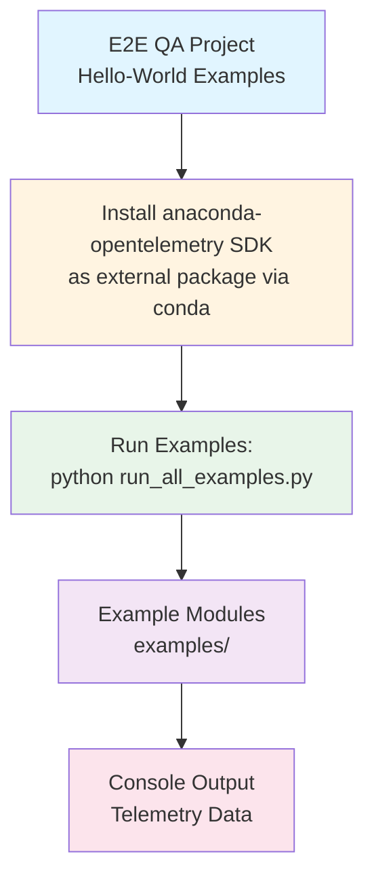
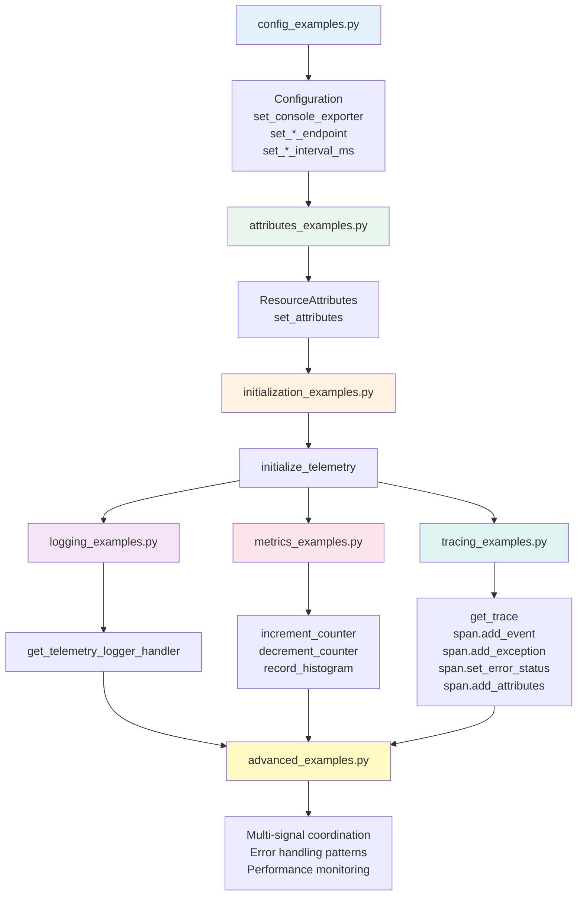
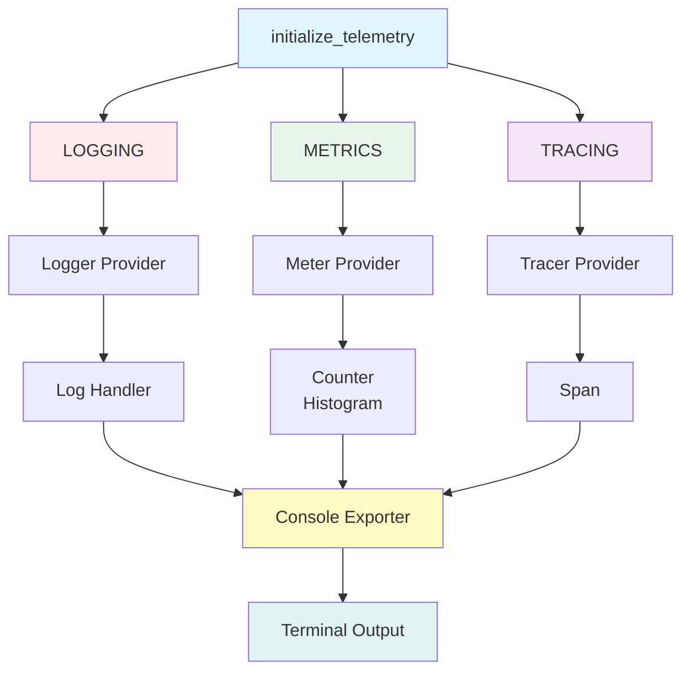
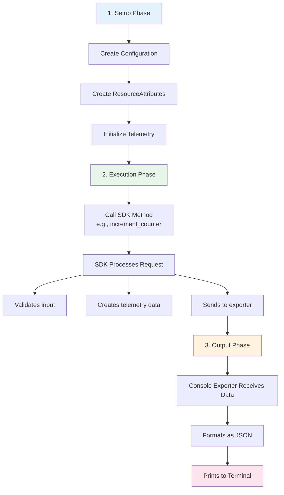
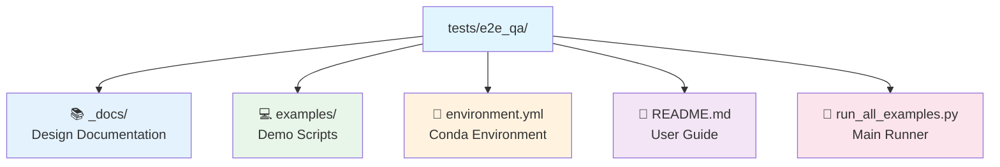
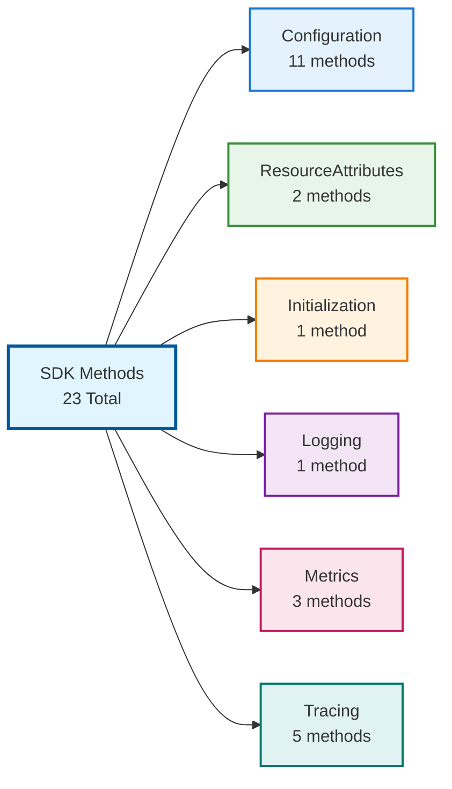
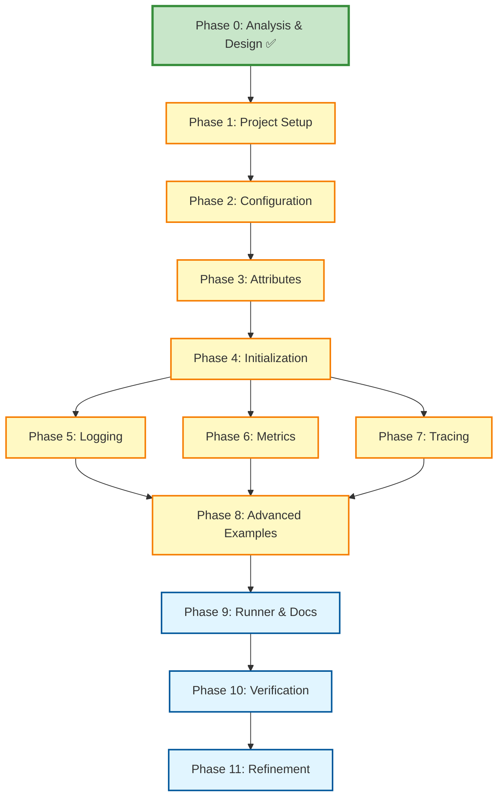
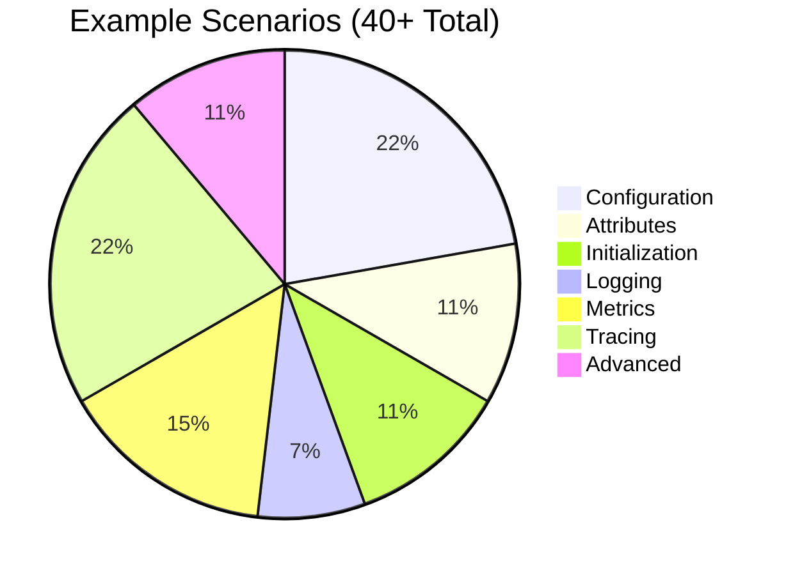
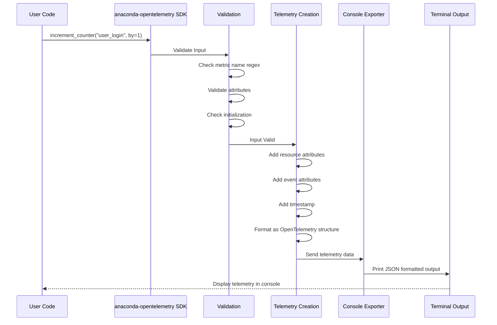
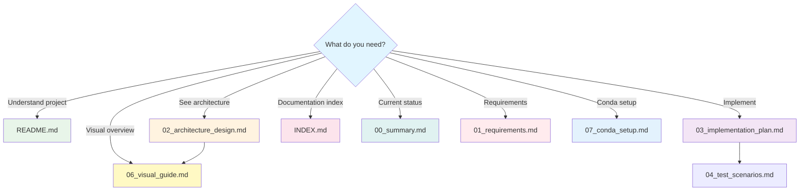

# E2E QA Project - Visual Guide

## Project Flow Diagram

---

## Module Dependency Flow

---

## Signal Type Flow

---

## Example Execution Flow

---

## Directory Structure Visual

See [README.md](../README.md#project-structure) for the complete project structure.

---

## SDK Method Coverage Map

**Coverage**: 100% of SDK methods (23 total)

### Method Details by Category

| Category | Methods | File |
|----------|---------|------|
| **Configuration** (11) | `Configuration()`, `set_logging_endpoint()`, `set_tracing_endpoint()`, `set_metrics_endpoint()`, `set_console_exporter()`, `set_logging_level()`, `set_metrics_export_interval_ms()`, `set_tracing_export_interval_ms()`, `set_tracing_session_entropy()`, `set_skip_internet_check()`, `set_use_cumulative_metrics()` | `config_examples.py` |
| **ResourceAttributes** (2) | `ResourceAttributes()`, `set_attributes()` | `attributes_examples.py` |
| **Initialization** (1) | `initialize_telemetry()` | `initialization_examples.py` |
| **Logging** (1) | `get_telemetry_logger_handler()` | `logging_examples.py` |
| **Metrics** (3) | `increment_counter()`, `decrement_counter()`, `record_histogram()` | `metrics_examples.py` |
| **Tracing** (5) | `get_trace()`, `span.add_event()`, `span.add_exception()`, `span.set_error_status()`, `span.add_attributes()` | `tracing_examples.py` |

---

## Implementation Sequence

**Phase Status**:
- ✅ **Phase 0**: Analysis & Design (COMPLETE)
- ⏳ **Phases 1-11**: Implementation (TODO)

**Note**: Phases 5-7 (Logging, Metrics, Tracing) can be done in parallel after Phase 4 (Initialization)

---

## Example Scenario Coverage

**Scenario Breakdown**:

| Category | Count | Examples |
|----------|-------|----------|
| Configuration | 6 | Basic config, console exporter, endpoints, intervals, entropy, logging level |
| Attributes | 3 | Basic, custom, environment attributes |
| Initialization | 3 | Full, selective signals, default |
| Logging | 2 | Basic, structured logging |
| Metrics | 4 | Counter increment/decrement, histogram, multiple metrics |
| Tracing | 6 | Basic trace, events, exceptions, attributes, nested, propagation |
| Advanced | 3 | Multi-signal, error handling, performance monitoring |

---

## Data Flow Diagram

---

## Quick Navigation Map

---

## Legend

**Status Icons**:
- ✅ Complete
- ⏳ In progress/Pending
- ❌ Not applicable

**File Type Icons**:
- 📚 Documentation
- 💻 Source code
- 🐍 Python/Conda
- 📦 Dependencies
- ⚙️ Configuration
- 📖 User guide
- 🚀 Main entry point

---

**Visual Guide Version**: 2.0  
**Last Updated**: 2026-01-16  
**Status**: Design Phase Complete ✅  
**Format**: Mermaid Diagrams
